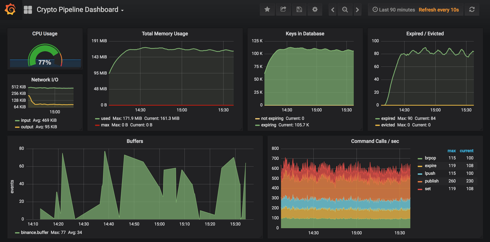

crypto-pipeline
===============

A platform for real-time ingestion and processing of cryptocurrency trading events, built with TypeScript, Node.js and Redis.

Web Console
-----------

This is a web application that allows the user to consume the stream very easily by writing JavaScript code that handles every incoming message, useful for testing algorithms or quickly calculating data. It is available at [port 7980](http://localhost:7980) by default.

Monitoring
----------

A dashboard based on [Grafana](https://grafana.com/)+[Prometheus](https://prometheus.io/) is provided out of the box. If running with docker-compose, it should be available at [port 3000](http://localhost:3000) by default.

### How does it work

We are using [redis_exporter](https://github.com/oliver006/redis_exporter) which fetches metrics from Redis and injects them into Prometheus, which in turn is used by Grafana as the data feed for rendering the charts.

The dashboard is preconfigured in the [`grafana/etc`](grafana/etc) directory.

