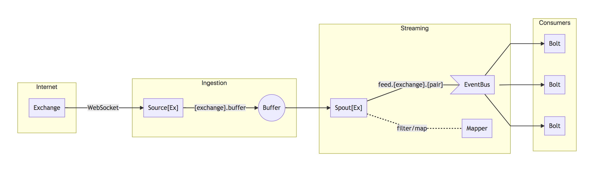
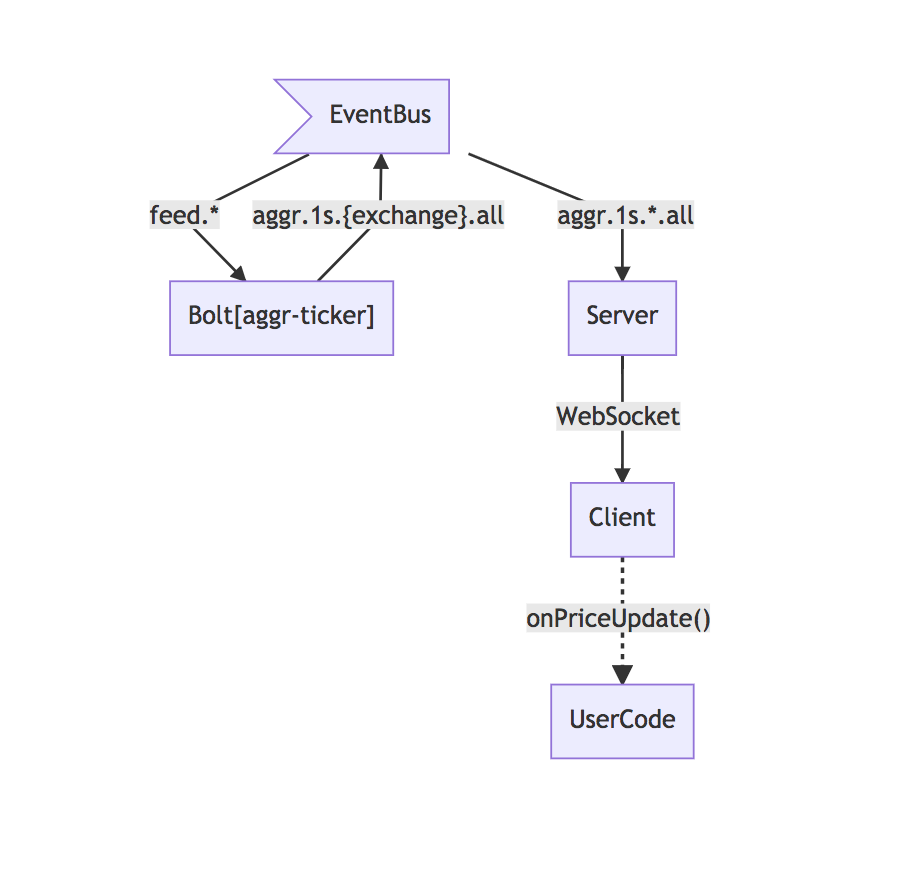

crypto-pipeline
===============

A platform for real-time ingestion and processing of cryptocurrency trading events based on TypeScript, Node.js and Redis.

Architecture
------------

The architecture is a microservice architecture with 3 stages: Ingestion, Streaming and Consumers. The [terminology and concepts](https://www.ibm.com/developerworks/library/os-twitterstorm/#fig1) used was partially borrowed from [Apache Storm](https://storm.apache.org).



### Exchange

Represents the API service provided by a given exchange (e.g. GDAX, OKEX, Binance). Typically a WebSocket interface is available for consuming real-time events.

### Source

The **Source** service has the following responsabilities:

- Establish a connection to the exchange WebSocket (taking care of reconnections and errors)
- Annotate the incoming messages with `$source` and `$its` (ingestion timestamp) properties
- Insert the message into the Buffer

### Buffer

It is a Redis List (by default under the key `{exchange}.buffer`, e.g. `gdax.buffer`).

### Spout

The **Spout** service has the following responsabilities:

- Take messages from the buffer
- Apply a mapping to the message (see "Mappers" below)
- Publish the message to the event bus via the channel/stream `{prefix}.{exchange}.{pair}` where `prefix` is by default `feed`; e.g. `feed.gdax.ETH-BTC`.

### Mapper

Mappers are not services but tiny modules that are imported and used by the Spout. They are currently very dumb at this point. Eventually they will probably grow to be responsible for mapping exchange-specific format to a normalized platform format.

Depending on the exchange, they might filter some messages.

Right now the only normalization they do is in the currency pair, stamping all messages with a `$pair` property. The rest of the message is preserved in the original format from the exchange.

### Event Bus

It is a Redis Pub/Sub and nothing else. Messages are `publish`ed by Spouts and consumers may `subscribe` to a specific channel or `psubscribe` to a pattern, e.g. `feed.*` or `feed.*.ETH-BTC`.

### Bolt

The **Bolt** service can be seen as a pipe or function. It subscribes to one or more channels in the event bus, receives a message, does some computation and emits another message in result.

Bolts need to process incoming messages fast enough to not allow event bus buffering to build up. Otherwise they will be disconnected from the channel. It is recommended for bolts to not take more than 30ms, if they do you may want to fork the stream into a deferred one by having a bolt that puts messages into a buffer/queue and have another one that processes at its pace.

Current Exchanges
-----------------

* [GDAX](https://docs.gdax.com/#the-code-classprettyprinttickercode-channel)
* [OKEX](https://fix.okex.com/ws_api.html)
* [Binance](https://github.com/binance-exchange/binance-official-api-docs/blob/master/web-socket-streams.md#individual-symbol-ticker-streams)

Current Bolts
-------------

### Aggregated Ticker

Calculates highest, lowest, sum and average of all available stats, per currency pair per exchange.


#### What does it do

1. Subscribes to all available source feeds, which Spouts publish under `feed.{exchange}.{pair}`

2. Opens 1-minute and 1-second aggregation windows for every exchange, using a exchange-specific module that knows the format of the message (`aggr-binance`, `aggr-gdax`, `aggr-okex`)

3. Every incoming message is enqueued into both windows, which  stamp a set of common properties (see "Common Aggregated Format" below) and calculate the aggregated stats for every existing individual stat (see "Aggregation" below)

4. When each time window emits (every 1 minute and 1 second respectively), it

   4.1. Stores the stats in Redis under the key `{exchange}.{pair}.{1s|1m}.{timestamp}`, e.g. `gdax.ETH-BTC.1s.1522665224000`;

   4.2. Sets an expiration for that key, by default 1 hour for second aggregation and 30 days for minute aggregation;

   4.3. Publishes the stats back to the event bus via the channels `aggr.{1s|1m}.{exchange}.{pair}` and `aggr.{1s|1m}.{exchange}.all`, the latter containing all pairs in a single message. E.g. `aggr.1s.gdax.ETH-BTC` and `aggr.1s.gdax.all`.

#### Common Aggregated Format

All aggregated messages have properties derived from the exchange-specific stats, but also they extend from a base common type that provides a set of useful and normalized properties:

| property | description |
| --- | --- |
| timestamps | timestamps of messages involved in the aggregation |
| count | number of messages involved in the aggregation |
| time | timestamp associated to the aggregation (e.g. this is second 6 in time 18:45:**06**) |
| unit | unit for the `time` above; `m` for minutes or `s` for seconds
| pair | currency pair

#### Aggregation

The appended aggregated properties are stamped with the original stat name, prefixed by `highest`, `lowest`, `sum`, `average` and using the original notation; for instance, GDAX uses underscore_notation, so for the stat `best_ask` the result would look like this:

```json
{
  highest_best_ask: "673",
  lowest_best_ask: "672.59",
  sum_best_ask: "2691.59",
  average_best_ask: "672.8975"
}
```

In turn, OKEX uses camelCaseNotation, so the output message would be:

```json
  highestSell: "0.0691",
  lowestSell: "0.0691",
  sumSell: "0.2073",
  averageSell: "0.04606666666666666667"
```

For a complete reference of the aggregated types and their properties, check [their type definitions](src/bolts/types.ts).

Web Console
-----------

This is a web application that allows the user to consume the stream very easily by writing JavaScript code that handles every incoming message, useful for testing algorithms or quickly calculating data. It is available at [port 7980](http://localhost:7980) by default.


### How does it work



The app server subscribes to the 1-second aggregated channel and sends the data to the client via WebSockets. The client invokes the user's function handler passing the message as argument.

The helper functions `print` and `clear` allows to write output.

Monitoring
----------

A dashboard based on [Grafana](https://grafana.com/)+[Prometheus](https://prometheus.io/) is provided out of the box. If running with docker-compose, it should be available at [port 3000](http://localhost:3000) by default.

### How does it work

We are using [redis_exporter](https://github.com/oliver006/redis_exporter) which fetches metrics from Redis and injects them into Prometheus, which in turn is used by Grafana as the data feed for rendering the charts.

The dashboard is preconfigured in the [`grafana/etc`](grafana/etc) directory.


Running the platform
--------------------

### Prerequisites

You need [Docker](https://docs.docker.com/install/) and [Docker Compose](https://docs.docker.com/compose/install/) installed.

### Configuration

The platform includes all necessary defaults; in order to change any parameter you need to edit the `process.json` file.

The structure of this file is:

```json
{
  "name": "",   // process name
  "script": "", // script name
  "env": {      // environment variables
                // here's what you probably
                //           want to change
  }
},
```

The following is a table of configuration values:

| Process | Variable name | Example | Description |
| --- | --- | --- | --- |
| `gdax-source` | `PAIRS` | `["BTC-USD","LTC-USD"]` | Pairs to subscribe for notifications |
| `okex-source` | `PAIRS` | `["btc_usdt","eth_usdt"]` | Pairs to subscribe for notifications |
| `aggr-ticker-bolt` | `EXPIRATION_SECONDS` | `900` | Expiration time (in seconds) for 1-second aggregation data |
| `aggr-ticker-bolt` | `EXPIRATION_MINUTES` | `1800` | Expiration time (in seconds) for 1-minute aggregation data |

### Start

```bash
$ docker-compose up -d --build
```

To see logs, you can type

```bash
$ docker-compose logs
```

You can also open the monitor dashboard by opening a browser at http://localhost:3000, and the web console at http://localhost:7980.

### Stop and resume

```bash
$ docker-compose stop
$ docker-compose start
```

### Stop and destroy all containers

```bash
$ docker-compose down
```
